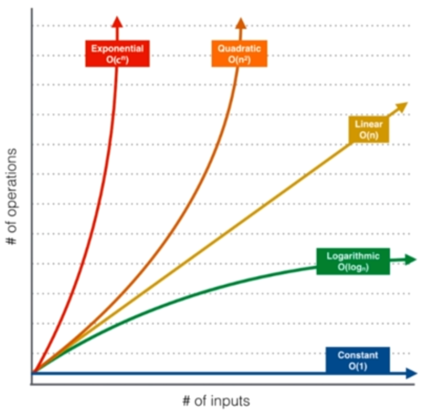

# 时间复杂度

## 什么是大 O

- n表示数据规模
- O(f(n)) 表示运行算法所需要执行的指令数，和 f(n) 成正比

| 算法或操作      | 时间复杂度 | 所需指令数示例 |
| --------------- | ---------- | -------------- |
| 二分查找法      | O(logn)    | a × logn       |
| 寻找最大/最小值 | O(n)       | b × n          |
| 归并排序算法    | O(nlogn)   | c × nlogn      |
| 选择排序法      | O(n²)      | d × n²         |

在业界，使用 O 来表示算法的执行最低上界

## 常用复杂度介绍

| 时间复杂度            | 效率等级 | 核心特征                                                            | 典型算法/场景（简洁版）          |
| --------------------- | -------- | ------------------------------------------------------------------- | -------------------------------- |
| O(1) 常数阶           | 极致高效 | 执行步数固定，与输入数据量n无关，效率最稳定                         | 数组下标访问、哈希表查询         |
| O(log n) 对数阶       | 极高效   | 每次操作将问题规模按固定比例缩小（如折半），n增大时执行时间增长缓慢 | 二分查找、平衡二叉树操作         |
| O(n) 线性阶           | 高效     | 执行步数和输入数据量成正比，遍历一次全部数据                        | 数组单次遍历、线性查找           |
| O(n log n) 线性对数阶 | 良好     | 线性遍历与对数操作结合，是大规模数据场景下的最优可接受复杂度        | 快速排序、归并排序、堆排序       |
| O(n²) 平方阶          | 一般     | 两层嵌套遍历，n增大时执行时间快速上升                               | 冒泡排序、选择排序、二维数组遍历 |
| O(2ⁿ) 指数阶          | 极差     | n每增加1，执行时间翻倍，n≥20时会出现明显性能瓶颈                    | 无优化递归斐波那契、子集枚举     |
| O(n!) 阶乘阶          | 不可用   | 增长极快，n≥10几乎无法执行，仅理论存在                              | 全排列暴力枚举、无剪枝TSP问题    |

> 补充说明：表格按效率从高到低排序，工程开发中优先选择O(1)~O(n log n)复杂度的算法，避免使用O(2ⁿ)和O(n!)；大O表示法仅关注算法执行时间的核心增长趋势，忽略常数项和低阶项。

## 数据规模的概念

如果想在 1s 之内解决问题：

- O(n^2) 的算法可以处理大约 10^4 级别的数据
- O(n) 的算法可以处理大约 10^8 级别的数据
- O(nlogn) 的算法可以处理大约 10^7 级别的数据
