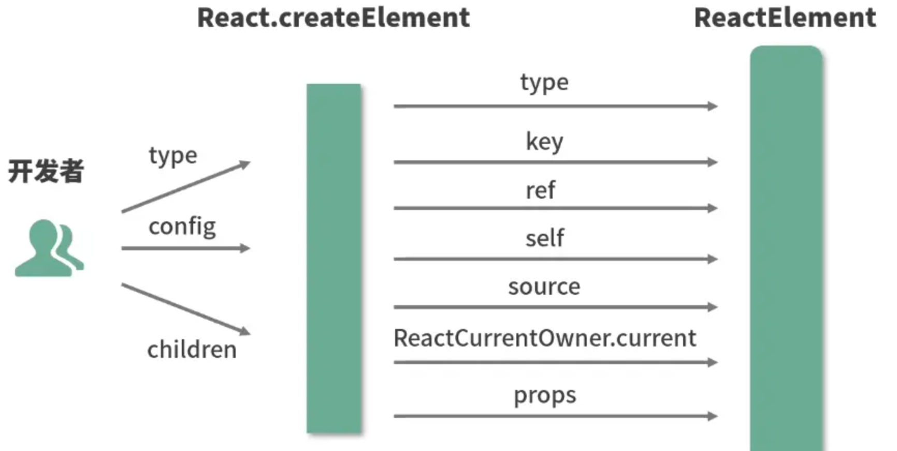
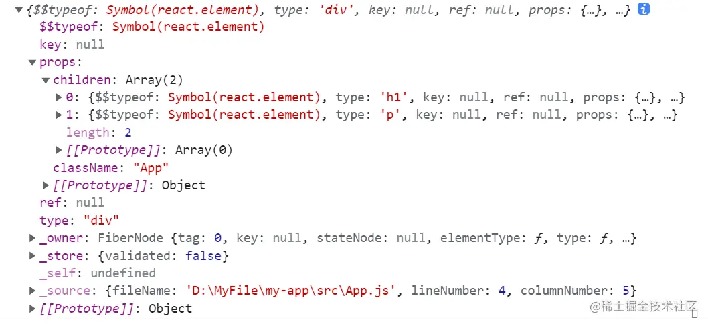

# JSX

## JSX 的本质

> JSX 是 **JavaScript 的语法扩展**，与模板语言接近，但充分具备 JavaScript 的能力。
>
> **核心结论：JSX 本质是 `React.createElement` 的语法糖。**

## Babel：让 JSX 在 JS 中生效

> **Babel** 是一个工具链，主要用于将 ECMAScript 2015+ 代码转换为向后兼容的 JS 语法，以便运行在当前和旧版本的浏览器中。

Babel 能将 JSX 转换为标准 JS。示例如下：

**转换前（JSX）：**

```html
<div className="App">
  <h1 className="title">I am the title</h1>
  <p className="content">I am the content</p>
</div>
```

**转换后（JS）：**

```tsx
'use strict'

/*#__PURE__*/
React.createElement(
  'div',
  { className: 'App' },
  /*#__PURE__*/ React.createElement('h1', { className: 'title' }, 'I am the title'),
  /*#__PURE__*/ React.createElement('p', { className: 'content' }, 'I am the content'),
)
```

## React 选用 JSX 的动机

JSX 允许前端开发者使用**最熟悉的 HTML 标签语法**来创建虚拟 DOM，在降低学习成本的同时，提升了研发效率与研发体验。

## JSX 如何映射为 DOM

整个链路：**JSX → `React.createElement` → `ReactElement`（虚拟 DOM）→ `ReactDOM.render` → 真实 DOM**

### `createElement` 源码解读

```js
export const createElement = (type, config, children) => {
  let propName
  const props = {}
  let key = null
  let ref = null
  let self = null
  let source = null

  // 1. 处理 config：提取 ref、key，其余属性挂载到 props
  if (config != null) {
    if (hasValidRef(config)) {
      ref = config.ref
    }
    if (hasValidKey(config)) {
      key = '' + config.key // key 值字符串化
    }
    self = config.__self === undefined ? null : config.__self
    source = config.__source === undefined ? null : config.__source

    for (propName in config) {
      if (hasOwnProperty.call(config, propName) && !RESERVED_PROPS.hasOwnProperty(propName)) {
        props[propName] = config[propName]
      }
    }
  }

  // 2. 处理 children：单个子节点直接赋值，多个子节点组成数组
  const childrenLength = arguments.length - 2
  if (childrenLength === 1) {
    props.children = children
  } else if (childrenLength > 1) {
    const childArray = Array(childrenLength)
    for (let i = 0; i < childrenLength; i++) {
      childArray[i] = arguments[i + 2]
    }
    props.children = childArray
  }

  // 3. 处理 defaultProps：填充未传入的默认属性
  if (type && type.defaultProps) {
    const defaultProps = type.defaultProps
    for (propName in defaultProps) {
      if (props[propName] === undefined) {
        props[propName] = defaultProps[propName]
      }
    }
  }

  // 4. 调用 ReactElement 创建元素对象并返回
  return ReactElement(type, key, ref, self, source, ReactCurrentOwner.current, props)
}
```

#### 入参说明

`createElement(type, config, children)` 三个参数包含了一个元素所需的全部信息：

| 参数           | 说明                                                      |
| -------------- | --------------------------------------------------------- |
| **`type`**     | 节点类型，可以是原生 HTML 标签（如 `'div'`）或 React 组件 |
| **`config`**   | 对象形式，包含组件的所有属性（props）                     |
| **`children`** | 子节点内容，即标签之间嵌套的元素或文本                    |

**示例：**

```tsx
React.createElement(
  'ul',
  { className: 'list' }, // config
  React.createElement('li', { key: '1' }, '1'), // children[0]
  React.createElement('li', { key: '2' }, '2'), // children[1]
)
```

等价 DOM 结构：

```html
<ul class="list">
  <li key="1">1</li>
  <li key="2">2</li>
</ul>
```

#### 函数体职责

`createElement` 是**开发者与 `ReactElement` 之间的"参数中介"**：


接收开发者传入的相对简单的参数 → 格式化处理 → 调用 `ReactElement` 创建元素。



### `ReactElement` 出参解读

`createElement` 最终调用 `ReactElement`，返回一个**虚拟 DOM 节点对象**：

```tsx
const ReactElement = function (type, key, ref, self, source, owner, props) {
  const element = {
    $$typeof: REACT_ELEMENT_TYPE, // 常量，标识这是一个 ReactElement
    type: type,
    key: key,
    ref: ref,
    props: props,
    _owner: owner, // 记录创造该元素的组件
  }
  return element
}
```

`ReactElement` 将参数"组装"成 `element` 对象并返回：


在控制台输出组件 JS，可以看到这个标准的 `ReactElement` 对象实例：



> 这个实例本质是 **JS 对象形式存在的对 DOM 的描述**，也就是"虚拟 DOM"中的一个节点。

### `ReactDOM.render`：虚拟 DOM → 真实 DOM

```tsx
ReactDOM.render(
  element, // 需要渲染的 ReactElement
  container, // 挂载目标（真实 DOM 节点）
  [callback], // 可选，渲染完成后的回调
)
```

**实际使用：**

```tsx
const rootElement = document.getElementById('root')
ReactDOM.render(<App />, rootElement)
```

**`ReactDOM.render`** 接收 3 个参数，将虚拟 DOM 渲染挂载到第二个参数指定的真实 DOM 节点上。

## 总结

| 步骤                | 说明                                                                        |
| ------------------- | --------------------------------------------------------------------------- |
| **JSX**             | JS 的语法扩展，本质是 `React.createElement` 的语法糖                        |
| **Babel 编译**      | 将 JSX 转换为 `React.createElement(...)` 调用                               |
| **ReactElement**    | `createElement` 处理参数后调用 `ReactElement`，生成虚拟 DOM 节点（JS 对象） |
| **ReactDOM.render** | 将虚拟 DOM 渲染为真实 DOM，挂载到页面上                                     |

## 常见考点

### 1. JSX 基本概念

> **考察点**：候选人是否理解 JSX 只是语法糖，底层是 `React.createElement`，而不是真正的 HTML。
>
> **Q：JSX 是什么？它和 HTML 有什么不同？**

JSX 是 JS 语法扩展，用于在 JS 代码中嵌入类 HTML 结构，最终被 Babel 编译为 `React.createElement` 调用，生成虚拟 DOM。与 HTML 的主要区别：

- 属性名使用驼峰命名（`className` 而非 `class`）
- 所有标签必须显式闭合
- `{}` 内可嵌入任意 JS 表达式

### 2. JSX 语法规则

#### 标签闭合

> **考察点**：候选人是否知道在 JSX 中所有标签必须闭合，不能像 HTML 一样省略闭合标签。
>
> **Q：JSX 中 `img` 标签需要如何书写？为什么？**

JSX 中所有标签**必须闭合**，包含自闭合标签：

```tsx
// ✅ 正确

<input type="text" />

// ❌ 错误（HTML 中合法，JSX 中不合法）

<input type="text">
```

#### 属性命名

> **考察点**：候选人是否了解 JSX 中如何使用 DOM 属性以及 React 特有的属性（`className`、`htmlFor`）。
>
> **Q：在 JSX 中如何传递 `class`、`for` 属性？为什么不能直接使用 `class` 和 `for`？**

因为 `class` 和 `for` 是 JS 保留字，JSX 中需使用对应的驼峰别名：

| HTML 属性  | JSX 属性    |
| ---------- | ----------- |
| `class`    | `className` |
| `for`      | `htmlFor`   |
| `tabindex` | `tabIndex`  |

```tsx
<label htmlFor="username" className="form-label">用户名</label>
<input id="username" className="form-input" />
```

#### 表达式嵌入

> **考察点**：候选人是否知道如何在 JSX 中插入 JS 表达式，以及如何处理表达式的返回值。
>
> **Q：在 JSX 中嵌入 JS 表达式如何书写？举例说明。**

JS 表达式需放在 `{}` 中：

```tsx
const name = 'World'
const isVip = true

const element = (
  <div>
    <h1>Hello, {name}!</h1>
    <p>积分：{100 * 2}</p>
    <span>{isVip ? '会员' : '普通用户'}</span>
  </div>
)
```

### 3. JSX 与 JS 结合

#### 只能放表达式，不能放语句

> **考察点**：候选人是否知道 JSX 只能放置有返回值的表达式，不能直接放 `if` 或 `for` 语句。
>
> **Q：在 JSX 中能写 `if` 和 `for` 语句吗？为什么不能？**

```tsx
// ❌ 错误：if 是语句，没有返回值
const el = <div>{if (flag) { <A /> }}</div>

// ✅ 正确：三元表达式有返回值
const el = <div>{flag ? <A /> : <B />}</div>
```

#### 条件渲染

> **考察点**：候选人是否知道如何在 JSX 中实现条件渲染，常用的技术是三元运算符和短路运算符。
>
> **Q：如何在 JSX 中根据条件渲染不同的内容？给一个例子。**

```tsx
// 三元运算符：有两个分支
{
  isLoggedIn ? <UserPanel /> : <Login />
}

// 短路运算符：只有一个分支
{
  hasData && <DataList data={data} />
}
```

#### 列表渲染

> **考察点**：候选人是否了解通过 `map` 函数遍历数组，并返回一组 JSX 元素。
>
> **Q：如何使用 `map` 在 JSX 中渲染一个列表？**

```tsx
const items = [
  { id: 1, name: '苹果' },
  { id: 2, name: '香蕉' },
]

return (
  <ul>
    {items.map((item) => (
      <li key={item.id}>{item.name}</li>
    ))}
  </ul>
)
```

---

### 4. 事件处理

> **考察点**：候选人是否了解 React 的事件系统，以及如何在 JSX 中正确处理事件。
>
> **Q：如何在 JSX 中处理用户点击事件？如何给按钮绑定 `onClick` 事件？**

- 事件名使用**驼峰命名**，如 `onClick`、`onChange`、`onSubmit`
- 传入**函数引用**，不加 `()`（加括号会立即执行）

```tsx
function App() {
  const handleClick = () => console.log('clicked')

  return (
    <>
      {/* ✅ 正确：传入函数引用 */}
      <button onClick={handleClick}>点击</button>

      {/* ❌ 错误：渲染时立即执行，而不是点击时执行 */}
      <button onClick={handleClick()}>点击</button>
    </>
  )
}
```

> **考察点（扩展）**：类组件中事件处理函数需要绑定 `this`，函数组件中不需要。

---

### 5. 类名与样式

> **考察点**：候选人是否知道 JSX 中 `class` 换成 `className`，以及内联样式的写法。
>
> **Q：JSX 中如何添加 CSS 类名？如何写内联样式？**

```tsx
// 类名：使用 className（字符串）
<div className="container active">...</div>

// 动态类名
<div className={isActive ? 'btn btn-active' : 'btn'}>...</div>

// 内联样式：传入对象，属性名用驼峰
<div style={{ fontSize: '16px', backgroundColor: '#fff', marginTop: 8 }}>...</div>
```

---

### 6. key 属性

> **考察点**：候选人是否理解 `key` 的作用，以及为什么不建议用 `index` 作为 `key`。
>
> **Q：JSX 列表渲染时为什么需要 `key`？用数组下标 `index` 作为 `key` 有什么问题？**

React 通过 **`key`** 识别列表中每个元素，在更新时高效定位变化的节点。

```tsx
// ✅ 使用稳定唯一的 id
{
  list.map((item) => <li key={item.id}>{item.name}</li>)
}

// ⚠️ 不推荐：列表重排时 index 会变，导致不必要的重新渲染甚至状态错误
{
  list.map((item, index) => <li key={index}>{item.name}</li>)
}
```

> **`key` 要求**：同级唯一、渲染过程中稳定不变。

---

### 7. Fragment

> **考察点**：候选人是否知道 JSX 不允许返回多个根元素，以及如何用 Fragment 解决。
>
> **Q：JSX 为什么不能返回多个根元素？如何解决？**

JSX 最终编译为 `React.createElement` 调用，一次只能返回一个元素。使用 `Fragment` 包裹多个元素而不产生额外 DOM 节点：

```tsx
// ✅ 完整写法（Fragment 可加 key，适用于列表）
import { Fragment } from 'react'
return (
  <Fragment>
    <h1>Title</h1>
    <p>Content</p>
  </Fragment>
)

// ✅ 简写（更常用）
return (
  <>
    <h1>Title</h1>
    <p>Content</p>
  </>
)
```

---

### 8. JSX 编译过程

> **考察点**：候选人是否了解 JSX 编译过程，以及如何转译成 `React.createElement`。
>
> **Q：React 中的 JSX 是如何转换成 JS 代码的？`React.createElement` 的三个参数分别是什么？**

```
JSX  →  Babel 编译  →  React.createElement(type, config, children)  →  ReactElement 对象（虚拟 DOM）
```

```tsx
// JSX 写法
const el = <div className="box">Hello</div>

// 编译后等价于
const el = React.createElement('div', { className: 'box' }, 'Hello')
```

三个参数含义：

| 参数       | 含义                              |
| ---------- | --------------------------------- |
| `type`     | 节点类型（`'div'` 或 React 组件） |
| `config`   | 属性对象（props）                 |
| `children` | 子节点内容                        |

---

### 9. 性能注意事项

> **考察点**：候选人是否了解不合理的 JSX 写法会影响渲染性能。
>
> **Q：JSX 中有哪些常见的性能问题？如何避免？**

- **避免 render 中创建内联函数**：每次渲染都会产生新的函数引用，导致子组件不必要地重新渲染

```tsx
// ❌ 每次渲染都创建新函数
<Button onClick={() => handleClick(id)} />

// ✅ 提取为 useCallback 或 class method
const handleClickItem = useCallback(() => handleClick(id), [id])
<Button onClick={handleClickItem} />
```

- **避免 render 中创建内联对象**：同理，每次都是新引用

```tsx
// ❌ 每次渲染都创建新对象
<div style={{ color: 'red' }} />

// ✅ 提取为常量或 useMemo
const style = { color: 'red' }
<div style={style} />
```

- **列表渲染使用稳定 `key`**：避免不必要的节点销毁重建
- React 虚拟 DOM 通过 **diff 算法**优化更新，但合理的 JSX 结构是前提

## 关联面试题

- [什么是 JSX](/interview/lib/react#什么是-jsx)
- [JSX转换真实 DOM 过程](/interview/lib/react#react-jsx-转换成真实-dom-过程)
