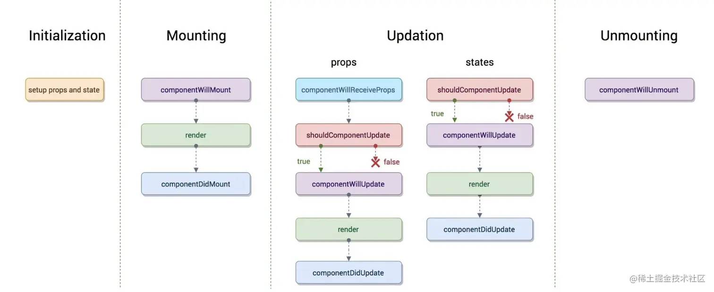
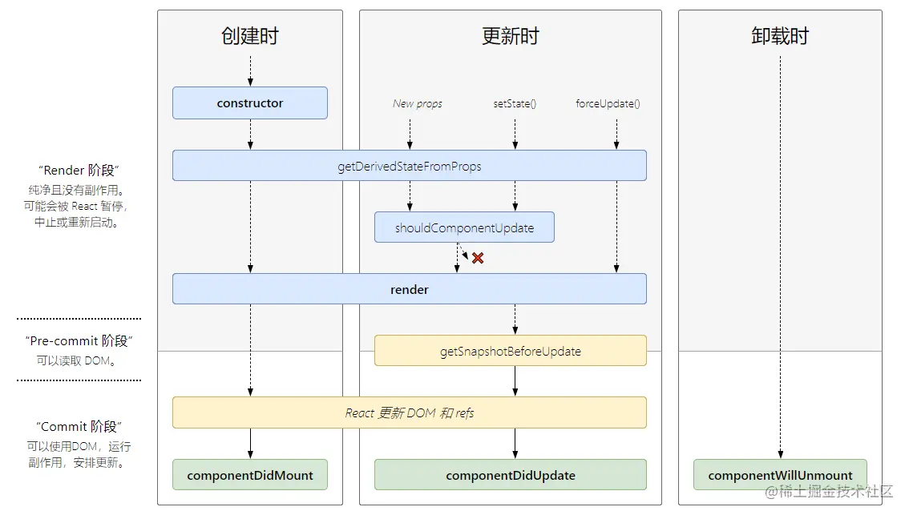

# 生命周期

React 组件的生命周期（Lifecycle）是指组件从创建、挂载、更新到卸载的整个过程。React 提供了丰富的钩子函数，允许我们在特定的时间点执行特定的逻辑。

## 新旧生命周期对比

**旧生命周期（React 16.3 之前）：**



**新生命周期（React 16.3 及之后）：**



新生命周期从 React 16.3 开始废弃了：componentWillMount、componentWillReceiveProps、componentWillUpdate 三个钩子函数。

## 废弃原因

React 16.3 引入 [React Fiber](https://zhuanlan.zhihu.com/p/26027085) 架构之后，任务变得可中断，可以实现时间分片。在中断执行的过程中，挂载和更新之前的生命周期钩子有可能不执行或者多次执行，因此这些钩子不再安全。React 建议使用以下带有 UNSAFE 前缀的版本，或者使用新的生命周期方法：

- UNSAFE_componentWillMount
- UNSAFE_componentWillReceiveProps
- UNSAFE_componentWillUpdate

## 生命周期详解

### constructor

在组件挂载之前被调用。在子类实现构造函数时，应在其他语句之前调用 super()。通常构造函数仅用于以下两种情况：

- 初始化内部 state
- 为事件处理函数绑定实例

:::tip
如果不初始化 state 或不进行方法绑定，则不需要写 constructor，只需直接设置 `this.state` 即可。

不能在 constructor 内部调用 `setState`，此时第一次 render 还未执行，意味着 DOM 还没挂载。
:::

### static getDerivedStateFromProps(nextProps, state)

在调用 render 之前调用，初始化和后续更新都会触发。

- **返回值**：返回一个对象来更新 state，返回 null 则不更新。
- **参数**：第一个参数为即将更新的 props，第二个参数为上一个状态的 state。可以比较 props 和 state 来添加一些限制条件，防止无用的 state 更新。

:::warning
`getDerivedStateFromProps` 是静态函数，不能使用 `this`，只能做一些无副作用的操作。
:::

### render()

是 class 组件中唯一必须实现的方法，用于渲染组件，必须返回 ReactNode。

:::warning
`render` 中调用 `setState` 会触发死循环，导致浏览器崩溃。
:::

### componentDidMount()

在组件挂载之后（插入 DOM 树）立即调用。这是发送网络请求、启用事件监听的好时机，并且可以在此函数中调用 `setState`。

### shouldComponentUpdate(nextProps, nextState)

在组件更新之前调用，控制组件是否进行渲染，返回 true 时组件更新，返回 false 则不更新。

包含两个参数：

- 第一个是即将更新的 props 值
- 第二个是即将更新的 state 值

可以根据更新前后 props 和 state 的比较来添加限制条件，决定是否更新，从而进行性能优化。

:::warning
不建议在 `shouldComponentUpdate` 中进行深比较或使用 `JSON.stringify`，这会显著损害性能。

同样不要在此调用 `setState`，会导致无限循环更新直到内存溢出。
:::

可以使用 `PureComponent` 替代手动实现。

### getSnapshotBeforeUpdate(prevProps, prevState)

在最近一次渲染输出被提交到 DOM 之前调用。它在 `render` 之后，但在 DOM 更新之前触发。

:::info
此生命周期使组件能够在 DOM 真正更新前捕获一些信息（如滚动位置）。它的任何返回值都会作为第三个参数传递给 `componentDidUpdate`。
:::

### componentDidUpdate(prevProps, prevState, snapshot)

会在更新后立即调用，首次渲染不会执行。

三个参数：

- 第一个是上一个阶段的 props 值
- 第二个是上一个阶段的 state 值
- 第三个是 `getSnapshotBeforeUpdate` 的返回值

:::warning
在此函数中进行 `setState` 必须配合条件判断（比如比较 props），否则会陷入无限循环。
:::

### componentWillUnmount()

在组件即将被卸载或销毁时调用。适合取消网络请求、移除监听事件、清除 DOM 元素、清理定时器等清理工作。

## 生命周期执行顺序

创建时：

- constructor
- static getDerivedStateFromProps
- render
- componentDidMount

更新时：

- static getDerivedStateFromProps
- shouldComponentUpdate
- render
- getSnapshotBeforeUpdate
- componentDidUpdate

卸载时：

- componentWillUnmount

## 示例

父组件：

```tsx
import React, { Component } from 'react'
import { Button } from 'antd'
import Child from './child'

const parentStyle = {
  padding: 40,
  margin: 20,
  backgroundColor: 'LightCyan',
}

const NAME = 'Parent 组件：'

export default class Parent extends Component {
  constructor() {
    super()
    console.log(NAME, 'constructor')
    this.state = {
      count: 0,
      mountChild: true,
    }
  }

  static getDerivedStateFromProps(nextProps, prevState) {
    console.log(NAME, 'getDerivedStateFromProps')
    return null
  }

  componentDidMount() {
    console.log(NAME, 'componentDidMount')
  }

  shouldComponentUpdate(nextProps, nextState) {
    console.log(NAME, 'shouldComponentUpdate')
    return true
  }

  getSnapshotBeforeUpdate(prevProps, prevState) {
    console.log(NAME, 'getSnapshotBeforeUpdate')
    return null
  }

  componentDidUpdate(prevProps, prevState, snapshot) {
    console.log(NAME, 'componentDidUpdate')
  }

  componentWillUnmount() {
    console.log(NAME, 'componentWillUnmount')
  }

  /**
   * 修改传给子组件属性 count 的方法
   */
  changeNum = () => {
    let { count } = this.state
    this.setState({
      count: ++count,
    })
  }

  /**
   * 切换子组件挂载和卸载的方法
   */
  toggleMountChild = () => {
    const { mountChild } = this.state
    this.setState({
      mountChild: !mountChild,
    })
  }

  render() {
    console.log(NAME, 'render')
    const { count, mountChild } = this.state
    return (
      <div style={parentStyle}>
        <div>
          <h3>父组件</h3>
          <Button onClick={this.changeNum}>改变传给子组件的属性 count</Button>
          <br />
          <br />
          <Button onClick={this.toggleMountChild}>卸载 / 挂载子组件</Button>
        </div>
        {mountChild ? <Child count={count} /> : null}
      </div>
    )
  }
}
```

子组件：

```tsx
import React, { Component } from 'react'
import { Button } from 'antd'

const childStyle = {
  padding: 20,
  margin: 20,
  backgroundColor: 'LightSkyBlue',
}

const NAME = 'Child 组件：'

export default class Child extends Component {
  constructor() {
    super()
    console.log(NAME, 'constructor')
    this.state = {
      counter: 0,
    }
  }

  static getDerivedStateFromProps(nextProps, prevState) {
    console.log(NAME, 'getDerivedStateFromProps')
    return null
  }

  componentDidMount() {
    console.log(NAME, 'componentDidMount')
  }

  shouldComponentUpdate(nextProps, nextState) {
    console.log(NAME, 'shouldComponentUpdate')
    return true
  }

  getSnapshotBeforeUpdate(prevProps, prevState) {
    console.log(NAME, 'getSnapshotBeforeUpdate')
    return null
  }

  componentDidUpdate(prevProps, prevState, snapshot) {
    console.log(NAME, 'componentDidUpdate')
  }

  componentWillUnmount() {
    console.log(NAME, 'componentWillUnmount')
  }

  changeCounter = () => {
    let { counter } = this.state
    this.setState({
      counter: ++counter,
    })
  }

  render() {
    console.log(NAME, 'render')
    const { count } = this.props
    const { counter } = this.state
    return (
      <div style={childStyle}>
        <h3>子组件</h3>
        <p>父组件传过来的属性 count ： {count}</p>
        <p>子组件自身状态 counter ： {counter}</p>
        <Button onClick={this.changeCounter}>改变自身状态 counter</Button>
      </div>
    )
  }
}
```

### 执行顺序总结

- 子组件改变自身状态时，在不对父组件产生副作用的情况下，父组件不会更新。
- 父组件发生变化，会触发自身和子组件的完整更新生命周期。

## 常见考点

> 以下内容总结了面试中关于生命周期的高频考点，建议重点关注新旧生命周期的差异及 Hooks 的模拟方式。

### 1. React 16.3 之后废弃了哪些生命周期？为什么？

> **Q：** 为什么 React 16.3 之后废弃了 `componentWillMount`、`componentWillReceiveProps`、`componentWillUpdate`？

- **原因**：React 引入了 Fiber 架构，原本同步的渲染过程变为了异步。这些在 `render` 之前调用的生命周期钩子可能会被多次触发，如果包含副作用（如 API 请求、DOM 修改），会导致数据不一致或性能问题。
- **替代方案**：使用 `getDerivedStateFromProps` 和 `getSnapshotBeforeUpdate`。

| 废弃方法                      | 替代方案                             |
| :---------------------------- | :----------------------------------- |
| `componentWillMount()`        | `componentDidMount()` 或初始化 state |
| `componentWillReceiveProps()` | `static getDerivedStateFromProps()`  |
| `componentWillUpdate()`       | `getSnapshotBeforeUpdate()`          |

### 2. 类组件生命周期 vs Hooks 的区别？

> **Q：** 如何使用 `useEffect` 模拟常用的生命周期方法？

Hooks 通过 `useEffect` 的第二个参数（依赖数组）来灵活模拟类组件的生命周期逻辑。

| 类组件方法               | Hooks 替代方案                                  |
| :----------------------- | :---------------------------------------------- |
| `componentDidMount()`    | `useEffect(() => { ... }, [])`                  |
| `componentDidUpdate()`   | `useEffect(() => { ... }, [deps])`              |
| `componentWillUnmount()` | `useEffect(() => { return () => { ... } }, [])` |

:::tip
`useEffect` 无依赖数组时，每次渲染后都会执行。
:::

### 3. shouldComponentUpdate 的作用是什么？

> **Q：** `shouldComponentUpdate` 的返回值代表什么？可以用来做什么？

- **作用**：控制组件是否进行重新渲染（Render Phase）。
- **逻辑**：返回 `true`（默认）继续更新，返回 `false` 则中断当前更新流程。
- **场景**：性能优化。通过比较 `nextProps` 和 `this.props` 或 `nextState` 和 `this.state` 来避免不必要的渲染。建议优先使用 `PureComponent` 或 `React.memo`。

### 4. 为什么 API 请求建议在 componentDidMount 中进行？

> **Q：** 为什么不建议在 `constructor` 或 `componentWillMount` 中发起请求？

1. **Fiber 机制**：`componentWillMount` 可能被多次调用，导致发送重复请求。
2. **SSR 兼容性**：在服务端渲染中，这些钩子也会执行，可能导致不必要的服务器负载。
3. **DOM 挂载**：`componentDidMount` 触发时 DOM 已经就绪，此时进行数据填充和 DOM 操作最安全。

### 5. React 18 并发模式对生命周期有何影响？

> **Q：** 为什么在 React 18 的 StrictMode 下 `useEffect` 会执行两次？

- **并发渲染**：React 18 引入了并发特性，React 可能会在后台准备多个版本的 UI。
- **严格模式检测**：在开发环境下，React 会模拟挂载、卸载并重新挂载组件的操作，以帮助开发者发现那些未正确清理副作用的代码。确保 `useEffect` 的 `cleanup` 函数逻辑完备是并发安全的关键。

## 关联面试题

- [Hooks 如何模拟生命周期](/interview/lib/react.html#hooks-如何模拟生命周期)
- [使用 Hooks 怎么实现类里面所有生命周期?](/interview/lib/react.html#hooks-如何模拟生命周期)
- [React 为什么废弃了 componentWillMount、componentWillReceiveProps、componentWillUpdate 这三个生命周期？具体问题和优化方案是什么？](/interview/lib/react.html#react-为什么废弃了-componentwillmount、componentwillreceiveprops、componentwillupdate-这三个生命周期-具体问题和优化方案是什么)
- [React 父子组件的生命周期执行顺序是怎么样的？](/interview/lib/react.html#react-父子组件的生命周期执行顺序是怎么样的)
