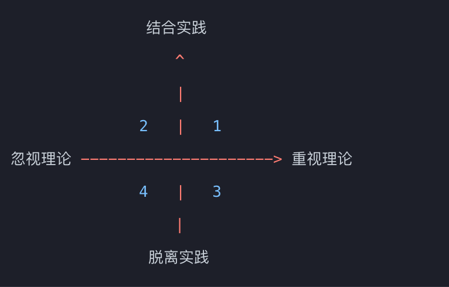
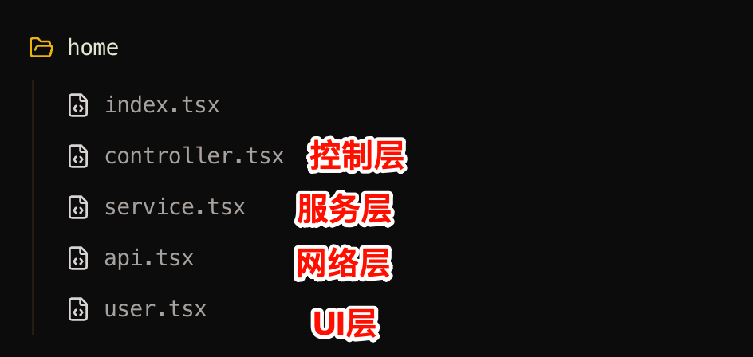
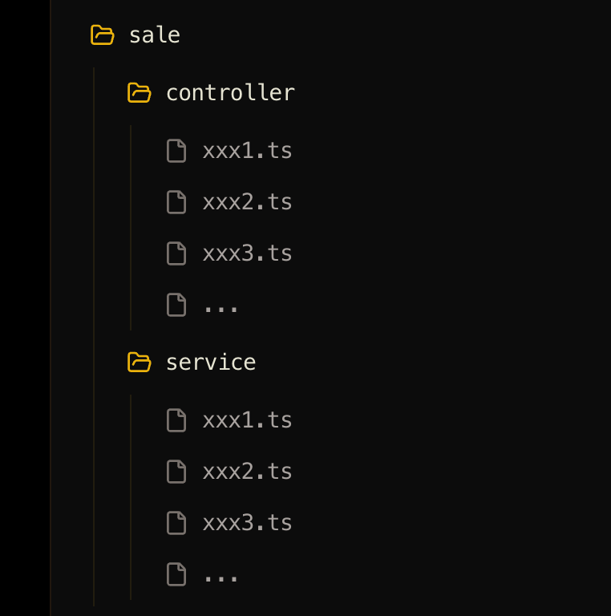

# React 核心原理

本篇从架构思维出发，对 React 核心设计理念与前端工程架构进行分析。

## 什么是结构化思维

结构化思维可以用「理论与实践」的四象限模型来理解：

### 经验主义

陷入第二象限即为经验主义。经验主义者往往忽略理论和逻辑，过度依赖个人直觉。

由于缺乏理论支撑，他们难以敏锐地发现表面上不同方案之间的共通性，学习效率较低，很难做到举一反三。

### 教条主义

陷入第三象限即为教条主义。教条主义者重视理论却脱离实践，方案往往无法落地，沦为纸上谈兵。

以个人发展为例，长期处于脱离一线开发的管理岗位，也很容易陷入教条主义。

### 机会主义

机会主义是指既不重视理论，也不重视实践，全凭幻想来自我安慰。

一个典型的误区是：「跟着教程敲一遍 = 学会了」。然而一旦脱离参考代码，就完全写不出来。长此以往，会在焦虑中变得越来越痛苦，甚至对自己能否在这个行业持续发展失去信心。

### 理论结合实践

学习过程一定要做到理论结合实践。否则学习效果大概率会表现为：无法输出、难以表达、容易遗忘、论述经不起推敲、无法形成完整的逻辑闭环、缺乏举一反三的能力。

**没有理论就不能解决普遍问题，没有实践就不能解决特定问题。**

理想的学习状态是：掌握了理论知识后，再结合若干实践案例，便能自然应对大多数场景。

## MVC 架构

MVC 是经典的分层架构模式，将应用划分为三个核心职责：

- **Model（数据模型）**：负责数据的存储与处理。在前端中通常表现为状态（state）或数据对象
- **View（视图层）**：负责 UI 呈现。在 React 中，JSX 就是 View 层的体现
- **Controller（控制层）**：负责协调数据与视图的关系。在 React 中，`useState` 定义的状态自带控制能力——当 state 变化时，UI 自动更新

## BFF 架构

BFF（Backend For Frontend）即「服务于前端的后端」，指在前后端之间设计一个中间层，用于处理数据格式差异和接口聚合。

### 为什么需要 BFF

假设一个前端页面需要的数据来自两个不同的接口。如果将聚合逻辑交给前端处理，会增加不必要的复杂度——需要处理并发请求、数据合并、加载状态等问题。

更好的做法是：在前后端之间部署一个 Node 中间层，由它负责聚合多个后端接口。这样对前端而言，一个页面（或一个组件单元）始终只对应一个接口，逻辑大幅简化。

本质上，BFF 就是将数据处理逻辑从前端应用层剥离，下沉到中间层。

### 传统 BFF 的局限

1. **沟通成本高**：前后端之间新增了一层，方案讨论的争议点增多
2. **维护成本高**：需要独立维护一个 Node 服务
3. **前端边缘化**：过度依赖中间层，可能弱化前端的核心价值
4. **灵活性不足**：如果中间层团队与前端业务团队不是同一批人，协作效率会大打折扣

### BFF 在前端项目中的应用

BFF 思想不一定要依赖独立的服务器。在纯前端 React 项目中，同样可以借鉴 BFF + MVC 的分层理念来应对复杂的数据逻辑：

- **API 层**：负责接口请求，封装 HTTP 调用
- **Service 层**：对 API 层返回的数据进行整合与转换
- **Controller 层**：对数据做进一步处理，包括兜底、判空、组合等
- **UI 层**：直接消费 Controller 提供的数据进行渲染

### 小结

在 MVC + BFF 的混合架构中，核心原则是**确保 View 层的简洁性**。无论后端接口多么复杂，都要做到：数据来源唯一、数据拿来即用。绝不应该在 UI 层处理额外的数据转换逻辑，否则会导致代码混乱、维护困难。

BFF 在前端项目中的运用非常灵活。每个组件可以根据实际场景，自由决定是否需要 Service、API、Controller 层，或者只使用其中之一。这意味着：简单场景用最精简的结构，复杂场景用完整的分层结构。这种按需组合的灵活性，恰恰是独立 Node 中间层难以具备的，因此在前端项目内直接实践 BFF 思想，往往是开发成本更低的选择。

## 组件拆分原则

### 总分总原则

**先思考整体，再深入细节。**

拿到需求后，先从全局视角规划组件的层级结构，再逐步拆解到具体实现。

### 拆分目的：提高可读性与可维护性

正确理解拆分的目的：**核心是提高可读性和可维护性**，而「复用」只是可维护性带来的附加收益。

拆分的判断标准：这段代码在后期维护时，是否可以不用过多关注其内部实现，从而简化阅读难度、快速定位问题。

封装的判断标准：只有当逻辑足够复杂时才需要封装。如果复杂度不高，不必强行拆分子组件。

:::tip
如果难以把控「是否足够复杂」的粒度，可以遵循一个简单的经验法则：**单个文件代码超过 200 行时，就应该考虑拆分**。
:::

### 拆分单位：需要能提炼出明确的语义

无论是封装函数、抽象架构层级还是拆分组件，都要考虑**语义化**。

如果拆分出的某段逻辑无法提炼出明确的语义（即无法用一个清晰的名称来描述它的职责），那么很可能存在拆分不合理的情况。以此标准反复练习，可以有效提升封装能力。

### 解耦与嵌套思维

#### 解耦

当 Service 层与 Controller 层变得复杂时，可以通过明确语义的方式将它们解耦处理，从而降低开发难度。很多时候，合在一起后变复杂的并不是代码本身，而是**思考问题的复杂度**。

正确的做法是：基于语义化拆分，利用分层思维将问题简化，逐层击破。

#### 嵌套思维

在解决复杂问题时，嵌套思维是一种必备的思考方式，也是架构师必须具备的核心能力。

例如在设计数据层时，进一步划分出 Service、Controller、Model 三个子层——这本身就是嵌套思维的体现。

运用嵌套思维时，关键在于**先模糊化当前层的内部复杂度**，把上层结构理清之后，再逐层深入。当单独思考数据层时，只聚焦于这一层的职责，最终再将其展开为 Service、Controller 等具体实现。

嵌套思维无处不在：高阶函数、递归结构、二维数组……都是它的体现。

## DDD 领域驱动设计

DDD（Domain-Driven Design）即领域驱动设计，是后端架构领域讨论较多的一种设计思想。

**前置知识**：DDD 是在传统 MVC 分层模型的基础上，随着业务复杂度的增长而衍生出的设计理念。因此在理解 DDD 之前，需要对 MVC 有深刻的认识。

:::warning
MVC 的分层依据是**代码的功能特性**（数据 / 视图 / 控制），而非业务特性。
:::

随着业务不断膨胀，Controller 的数量也会急剧增长。此时需要按照**业务边界进行内聚**——将相关的 Controller、Service、Model 归入同一个业务模块。这样做的好处是：每个业务模块高度独立，与其他模块之间的耦合极低，可以方便地将其中任何一个模块单独剥离出来，形成独立的新应用。

> 以业务为核心进行拆分，最终在服务端形成一个个独立的「领域（Domain）」，落点体现在数据库的表结构划分上。这种以业务内聚为指导的架构思想，就是领域驱动设计。

**DDD 是架构思维，微服务是落地实践。** 正确的做法是用 DDD 的思维去指导微服务的拆分与落地。

几个关键原则：

- 架构师必须对业务非常精通，能够合理地解耦表面上耦合的业务细节
- **上层依赖下层，下层不能反向依赖上层**
- 优秀的架构师需要具备全局视野——不仅对前端架构有深入理解，对后端架构也要有相当的认知。能够将前端、后端、业务融合思考的架构师，才是真正优秀的架构师
