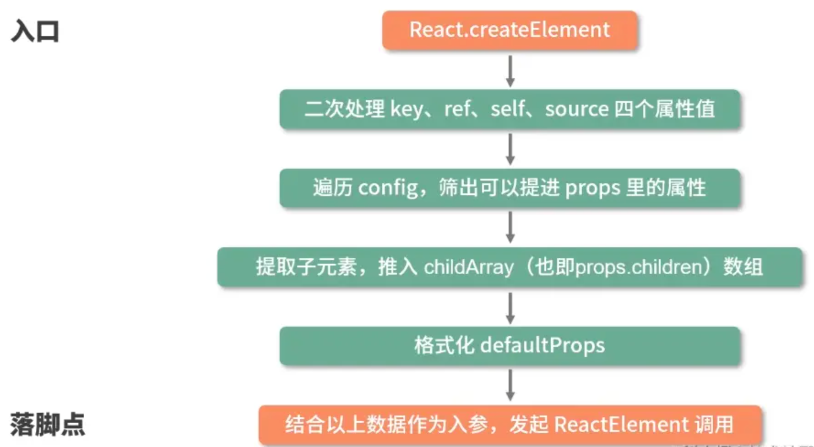
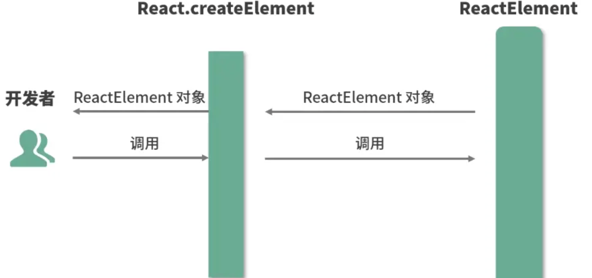

# JSX

## JSX的本质

> JSX 本质就是 JavaScript 的语法扩展，它和模板语言和接近，但是它充分具备 `JavaScript` 的能力

## JSX 语法是如何在 JS 中生效的：认识 Babel

> Babel是一个工具链，主要用于将 ECMAScript 2015+版本的代码转换为向后兼容的 JS 语法，以便能够运行在当前和旧版本的浏览器或其他版本中

比如可以将模板字符串转成 ES5 的字符串拼接代码，或者将 JSX 转换为 JS

转换前：

```html
<div className="App">
  <h1 className="title">I am the title</h1>
  <p className="content">I am the content</p>
</div>
```

转换后：

```tsx
'use strict'

/*#__PURE__*/
React.createElement(
  'div',
  {
    className: 'App',
  },
  /*#__PURE__*/ React.createElement(
    'h1',
    {
      className: 'title',
    },
    'I am the title',
  ),
  /*#__PURE__*/ React.createElement(
    'p',
    {
      className: 'content',
    },
    'I am the content',
  ),
)
```

**JSX 的本质是 React.createElement 的语法糖**

## React 选用 JSX 语法的动机

JSX 语法糖允许前端开发者使用最熟悉的 HTML 标签语法来创建虚拟 DOM，再降低学习成本的同时，也提升了研发效率与研发体验

## JSX 如何映射为 DOM

```js
// createElement 源码
export const createElement = (type, config, children) => {
  // propName 变量用于储存后面需要用到的元素属性
  let propName
  // props 变量用于储存元素属性的键值对集合
  const props = {}
  // key、ref、self、source 均为 React 元素的属性，此处不必深究
  let key = null
  let ref = null
  let self = null
  let source = null

  // config 对象中存储的是元素的属性
  if (config != null) {
    // 进来之后做的第一件事，是依次对 ref、key、self 和 source 属性赋值
    if (hasValidRef(config)) {
      ref = config.ref
    }
    // 此处将 key 值字符串化
    if (hasValidKey(config)) {
      key = '' + config.key
    }
    self = config.__self === undefined ? null : config.__self
    source = config.__source === undefined ? null : config.__source
    // 接着就是要把 config 里面的属性都一个一个挪到 props 这个之前声明好的对象里面
    for (propName in config) {
      if (
        // 筛选出可以提进 props 对象里的属性
        hasOwnProperty.call(config, propName) &&
        !RESERVED_PROPS.hasOwnProperty(propName)
      ) {
        props[propName] = config[propName]
      }
    }
    // childrenLength 指的是当前元素的子元素的个数，减去的 2 是 type 和 config 两个参数占用的长度
    const childrenLength = arguments.length - 2
    // 如果抛去type和config，就只剩下一个参数，一般意味着文本节点出现了
    if (childrenLength === 1) {
      // 直接把这个参数的值赋给props.children
      props.children = children
    } else if (childrenLength > 1) {
      // 声明一个子元素数组
      const childArray = Array(childrenLength)
      // 把子元素推进数组里
      for (let i = 0; i < childrenLength; i++) {
        childArray[i] = arguments[i + 2]
      }
      // 最后把这个数组赋值给props.children
      props.children = childArray
    }
    // 处理 defaultProps
    if (type && type.defaultProps) {
      const defaultProps = type.defaultProps
      for (propName in defaultProps) {
        if (props[propName] === undefined) {
          props[propName] = defaultProps[propName]
        }
      }
    }
    // 最后返回一个调用ReactElement执行方法，并传入刚才处理过的参数
    return ReactElement(type, key, ref, self, source, ReactCurrentOwner.current, props)
  }
}
```

### 入参解读

createElement 有 3 个入参，包含了一个元素所需的全部信息

- type：用于标识节点类型，可以是原生组件或 React 组件
- config：以对象形式传入，组件所有属性存在 config 对象中
- children：以对象形式传入，它记录的是组件标签之间嵌套的内容，也就是“子节点”，“子元素”

例子如下：

```tsx
React.createElement(
  'ul',
  {
    // 传入属性键值对
    className: 'list',
    // 从第三个入参开始往后，传入的参数都是 children
  },
  React.createElement(
    'li',
    {
      key: '1',
    },
    '1',
  ),
  React.createElement(
    'li',
    {
      key: '2',
    },
    '2',
  ),
)
```

DOM结构如下：

```html
<ul className="list">
  <li key="1">1</li>
  <li key="2">2</li>
</ul>
```

### 函数体拆解

createElement 在逻辑层面的任务流转



createElement 像是开发者和 ReactElement 之间调用了一层“转换器”，一个数据处理层，可以从开发者处接受相对简单的参数，将这些参数按照 ReactElement 的预期做一层格式化，最终通过调用 ReactElement 来实现元素的创建，整个过程如图所示


createElement 只是“参数中介”

### 出参解读

createElement 执行到最后会 return 一个针对 ReactElement 的调用

```tsx
const ReactElement = function (type, key, ref, self, source, owner, props) {
  const element = {
    // REACT_ELEMENT_TYPE是一个常量，用来标识该对象是一个ReactElement
    $$typeof: REACT_ELEMENT_TYPE,

    // 内置属性赋值
    type: type,
    key: key,
    ref: ref,
    props: props,
    // 记录创造该元素的组件
    _owner: owner,
  }
  //
  if (__DEV__) {
    // 这里是一些针对 __DEV__ 环境下的处理，对于大家理解主要逻辑意义不大，此处我直接省略掉，以免混淆视听
  }
  return element
}
```

ReactElement 把传入的参数按照一定的规范，“组装”进了 element 对象中，并返回给了 React.createElement，最终交回开发者手中，过程如下：



可以在控制台中输出组件的 JS，是一个标准的 ReactElement 对象实例


这个实例本质是**JS 对象形式存在的对 DOM 的描述**，也就是“虚拟 DOM”中的一个节点

虚拟 DOM 渲染到真实 DOM 是通过**ReactDOM.render**方法来填补，每一个入口都有 React.render 函数的调用

```tsx
ReactDOM.render(
  // 需要渲染的元素（ReactElement）
  element,
  // 元素挂载的目标容器（一个真实DOM）
  container,
  // 回调函数，可选参数，可以用来处理渲染结束后的逻辑
  [callback],
)
```

**ReactDOM.render** 方法接收 3 个参数，其中\*\*第二个
