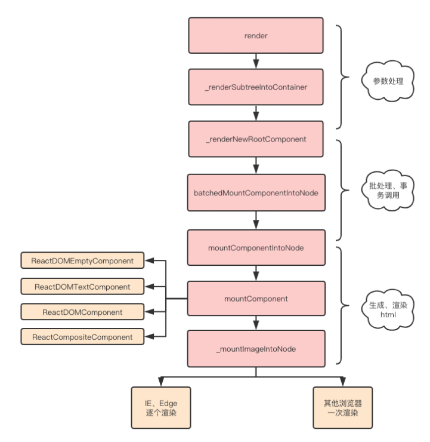

# React

## 什么是 JSX

JSX 即 JavaScript XML，一种在 React 组件内部构建标签的类 XML 语法，JSX 为 react.js 开发的一套语法糖，React 在不使用 JSX 的情况下一样可以工作，然而 JSX 可以提高组件可读性，因此推荐使用 JSX

```tsx
class MyComponent extends React.Component {
  render() {
    let props = this.props
    return (
      <div className="my-component">
        <a href={props.url}>{props.name}</a>
      </div>
    )
  }
}
```

**优点**：

- 允许使用熟悉的语法定义 HTML 元素树
- 提供更加语义化且移动的标签
- 程序结构更容易被直观化
- 抽象了 React Element 的创建过程
- 可以随时掌控 HTML 标签以及生成这些标签的代码
- 是原生的 JS

## React JSX 转换成真实 DOM 过程

### 是什么

JSX 通过 Babel 转成 React.createElement 形式，转换规则如下：

- 当首字母为小写时，其被认定为原生 DOM 标签，createElement 的第一个变量被编译为字符串
- 当首字母为大写时，其被认定为自定义组件，createElement 的第一个变量被编译为对象

最终都会通过 RenderDOM.render 方法进行挂载

### 过程

在 react 中，节点大致分为四个类别：

- 原生标签节点：type 是字符串，如 div、span
- 文本节点：type 就没有，这里是 TEXT
- 函数组件：type 是函数名
- 类组件：type 是类名

首次调用时，节点的 DOM 元素都会被替换，后续调用则会使用 Diff 算法进行高效更新

render 大致实现方法如下：

```js
function render(vnode, container) {
  console.log('vnode', vnode) // 虚拟DOM对象
  // vnode _> node
  const node = createNode(vnode, container)
  container.appendChild(node)
}

// 创建真实DOM节点
function createNode(vnode, parentNode) {
  let node = null
  const { type, props } = vnode
  if (type === TEXT) {
    node = document.createTextNode('')
  } else if (typeof type === 'string') {
    node = document.createElement(type)
  } else if (typeof type === 'function') {
    node = type.isReactComponent
      ? updateClassComponent(vnode, parentNode)
      : updateFunctionComponent(vnode, parentNode)
  } else {
    node = document.createDocumentFragment()
  }
  reconcileChildren(props.children, node)
  updateNode(node, props)
  return node
}

// 遍历下子vnode，然后把子vnode->真实DOM节点，再插入父node中
function reconcileChildren(children, node) {
  for (let i = 0; i < children.length; i++) {
    let child = children[i]
    if (Array.isArray(child)) {
      for (let j = 0; j < child.length; j++) {
        render(child[j], node)
      }
    } else {
      render(child, node)
    }
  }
}
function updateNode(node, nextVal) {
  Object.keys(nextVal)
    .filter((k) => k !== 'children')
    .forEach((k) => {
      if (k.slice(0, 2) === 'on') {
        let eventName = k.slice(2).toLocaleLowerCase()
        node.addEventListener(eventName, nextVal[k])
      } else {
        node[k] = nextVal[k]
      }
    })
}

// 返回真实dom节点
// 执行函数
function updateFunctionComponent(vnode, parentNode) {
  const { type, props } = vnode
  let vvnode = type(props)
  const node = createNode(vvnode, parentNode)
  return node
}

// 返回真实dom节点
// 先实例化，再执行render函数
function updateClassComponent(vnode, parentNode) {
  const { type, props } = vnode
  let cmp = new type(props)
  const vvnode = cmp.render()
  const node = createNode(vvnode, parentNode)
  return node
}
export default {
  render,
}
```

### 总结

虚拟 DOM 转换成真实 DOM 如图所示：



- 使用 createElement 函数对 key 和 ref 等特殊 props 进行处理，并获取 defaultProps 的默认 props 进行赋值，并且对传入的孩子节点进行处理，最终构造成一个虚拟 DOM 对象
- ReactDOM.render 将生成好的虚拟 DOM 渲染到指定容器上，其中采用了批处理、事务机制并且针对特定浏览器进行了性能优化，最终转换为真实 DOM
